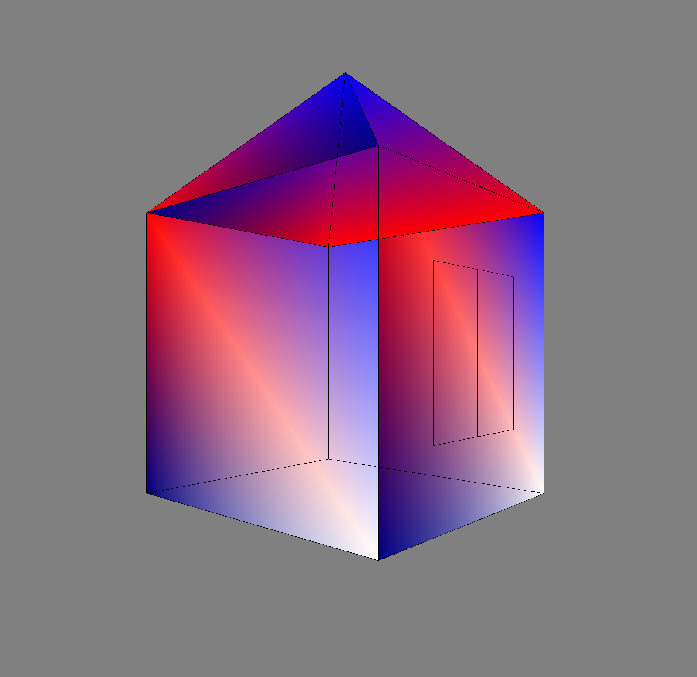

# Задача

• Реализовать любой графический примитив

• Добавить любое геометрическое преобразование (сдвиг, поворот и т.д.)

• Добавить обработку события (нажатия на кнопку и т.д.)

# Основная теория

Я реализовала Дом, который перемещается по нажатию кнопок вверх, вниз, влево, вправо и вращается по нажатию шифтов.Все это осуществила на языке Python с оболочкой PyOpenGL И Pygame.

Сначала определим координаты (x, y, z) каждой вершины домика (куба, пирамиды, квадрата и креста) vertices.Далее задаем ребра edges. Каждое ребро представлено кортежем, состоящим из двух чисел. Эти числа соответствуют номерам вершин, а ребро их соединяет. Как принято в Python, да и во многих других языках программирования, нумерация начинается с 0. Соответственно, 0 обозначает вершину (1, -1, -1), и так далее.

В функции, которая создает фактически сам дом def House(), мы итерируем по всем нашим ребрам (список edges), а затем каждой вершине в ребре (их там две) мы ставим в соответствие вершину из нашего списка вершин vertices (при помощи функции glVertex3fv). После прохождения всех ребер работа функции заканчивается и мы вызываем glEnd(), чтобы сообщить об этом OpenGL.
Затем для каждой поверхности (набора вершин) в кортеже поверхностей и для каждой вершины в этом списке из четырех вершин мы будем использовать функцию glColor3fv, которая будет окрашивать создаваемый нами объект. А потом мы, как и ранее, используем функцию glVertex3fv.

Функция gluPerspective определяет перспективу. Ее первый параметр определяет угол поля зрения и выражается в градусах. Второй параметр — это соотношение сторон дисплея, ширина, деленная на высоту.

Потом обрабатываем события и создаем реагирование на кнопки.
Функция glTranslatef умножает текущую матрицу на матрицу перехода.
Функция glRotatef умножает текущую матрицу на матрицу вращения.

Вызов glClear(GL_COLOR_BUFFER_BIT | GL_DEPTH_BUFFER_BIT) очищает буферы цвета и глубины OpenGL.

# Практическая реализация

**`lab1.py`**
```py
import pygame
from pygame.locals import *
from OpenGL.GL import *
from OpenGL.GLU import *

colors = (
    (0.5,0.6,0.7),
    (0,0, 0.5),
    (1, 0, 0),
    (0,0,1),
    (1,1,1)
    )

verticies = [
    (1, -1, -1),
    (1, 1, -1),
    (-1, 1, -1),
    (-1, -1, -1),
    (1, -1, 1),
    (1, 1, 1),
    (-1, -1, 1),
    (-1, 1, 1),

    (0, 2, 0),

    (1, 0.5, -0.5),
    (1, 0.5, 0.5),
    (1, -0.5, 0.5),
    (1, -0.5, -0.5),

    (1, 0, -0.5),
    (1, 0, 0.5),

    (1, -0.5, 0),
    (1, 0.5, 0),

    # (0.5, 1, -0.5),
    # (0.5, 1, 0.5),
    # (-0.5, 1, 0.5),
    # (-0.5, 1, -0.5),
    ]

edges = (
    (0,1),
    (0,3),
    (0,4),
    (2,1),
    (2,3),
    (2,7),
    (6,3),
    (6,4),
    (6,7),
    (5,1),
    (5,4),
    (5,7),

    (1, 8),
    (2, 8),
    (5, 8),
    (7, 8),

    (9, 10),
    (10, 11),
    (11, 12),
    (12, 9),
    (13,14),
    (15,16)
    )

surfaces = (
    (4,0,3,6),
    (0,1,2,3),
    (3,2,7,6),
    (6,7,5,4),
    (4,5,1,0),
    #(1,5,7,2), -
    
    (1, 5, 8),
    (2, 1, 8),
    (7, 2, 8),
    (5, 7, 8)
    )

def House(verticies):

    glBegin(GL_QUADS)
    for surface in surfaces:
        x = 0
        for vertex in surface:
            x += 1
            glColor3fv(colors[x])
            glVertex3fv(verticies[vertex])
    glEnd()

    glBegin(GL_LINES)
    for edge in edges:
        for vertex in edge:
            glColor3fv((0, 0, 0))
            glVertex3fv(verticies[vertex])
    glEnd()

def main():
    pygame.init()
    display = (2000,1600)
    pygame.display.set_mode(display, DOUBLEBUF|OPENGL)
    gluPerspective(60, (display[0]/display[1]), 0, 10)
    glClearColor (0.5, 0.5, 0.5, 0)
    glTranslatef(0, 0 , -10)

    # verticies1 = list()
    # for i in verticies:
    #     v = list(i)
    #     v[0] += 3
    #     v[1] += 3
    #     verticies1.append(tuple(v))
    while True:
        House(verticies)
        # House(verticies1)
        pygame.display.flip()
        for event in pygame.event.get():
            if event.type == pygame.QUIT or (event.type == pygame.KEYDOWN and event.key == pygame.K_0):
                pygame.quit()
                quit()
            elif event.type == pygame.KEYDOWN:
                if event.key == pygame.K_DOWN:   
                    glTranslatef(0, 0, 2)
                elif event.key == pygame.K_UP:
                    glTranslatef(0, 0, -2)
                elif event.key == pygame.K_RSHIFT:
                    glRotatef(-5, 0, 1, 0)
                elif event.key == pygame.K_LSHIFT:
                    glRotatef(5, 0, 1, 0)
                elif event.key == pygame.K_LEFT:
                    glTranslatef(-2, 0, 0)
                elif event.key == pygame.K_RIGHT:
                    glTranslatef(2, 0, 0)
        glClear(GL_COLOR_BUFFER_BIT|GL_DEPTH_BUFFER_BIT)
        
main() 
```



# Заключение 

В этой лабораторной я установила PyOpenGL и PyGame, научилась создавать точки, ребра в пространстве, а так же раскрашивать поверхности и вращать/перемещать созданный объект.