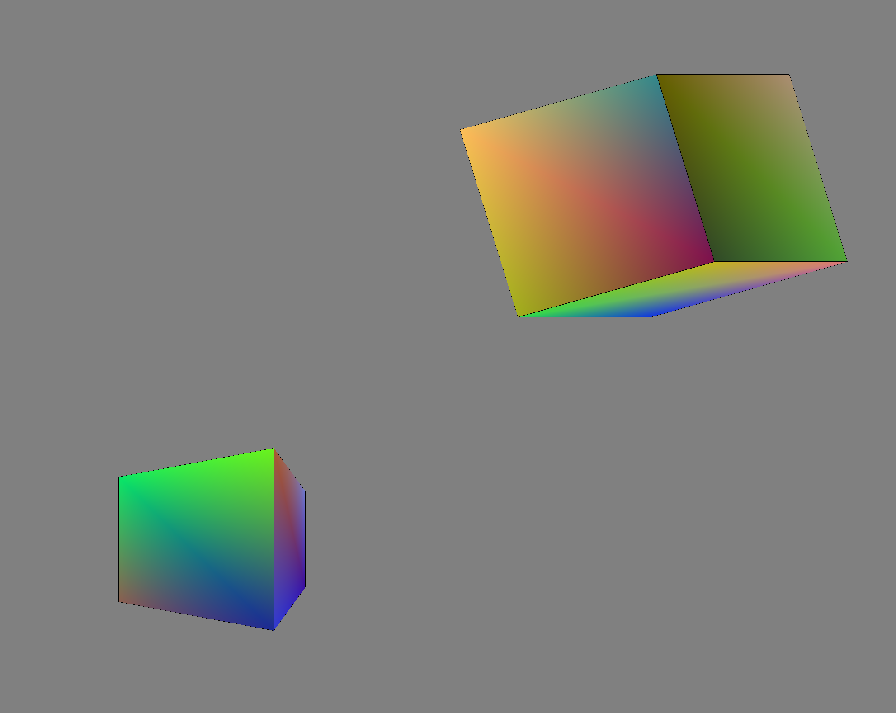

# Задача

1.Определить куб в качестве модели объекта сцены.

2.Определить преобразования, позволяющие получить заданный вид проекции (двухточечная перспектива). Для демонстрации проекции добавить в сцену куб (в стандартной
ориентации, не изменяемой при модельно-видовых преобразованиях основного объекта).

3.Реализовать изменение ориентации и размеров объекта (навигацию камеры) с помощью
модельно-видовых преобразований (без gluLookAt). Управление производится интерактивно с
помощью клавиатуры и/или мыши.

4.Предусмотреть возможность переключения между каркасным и твердотельным
отображением модели (glFrontFace/ glPolygonMode).

# Основная теория

Был реализован куб в двухточечной перспективе

Сначала определим координаты (x, y, z) каждой вершины куба vertices.Далее задаем ребра edges. Каждое ребро представлено кортежем, состоящим из двух чисел. Эти числа соответствуют номерам вершин, а ребро их соединяет. Как принято в Python, да и во многих других языках программирования, нумерация начинается с 0. Соответственно, 0 обозначает вершину (1, -1, -1), и так далее.

В функции, которая создает фактически сам куб def Cube(), мы итерируем по всем нашим ребрам (список edges), а затем каждой вершине в ребре (их там две) мы ставим в соответствие вершину из нашего списка вершин vertices (при помощи функции glVertex3fv). После прохождения всех ребер работа функции заканчивается и мы вызываем glEnd(), чтобы сообщить об этом OpenGL.
Затем для каждой поверхности (набора вершин) в кортеже поверхностей и для каждой вершины в этом списке из четырех вершин мы будем использовать функцию glColor3fv, которая будет окрашивать создаваемый нами объект. А потом мы, как и ранее, используем функцию glVertex3fv.

glEnable(GL_DEPTH_TEST) задает глубину.

Двухточечная перспектива создается при задании начальной матрицы m = [[0.87, 0.0, 1.0, 0.5], [0, 1, 0, 0], [0.5, 0, -1.73, -0.87], [0, 0, 1, 2]]. Повороты куба реализованы домножением на различные матрицы поворота. При нажатии на кнопки меняются углы, передаваемые в функцию создания матрицы поворота.

С помощью фунции glViewport() происходит "разделение экрана": куб в перспективе расположен в одном углу экрана, а куб без преобразований в другом.

Вызов glClear(GL_COLOR_BUFFER_BIT | GL_DEPTH_BUFFER_BIT) очищает буферы цвета и глубины OpenGL.

\newpage

# Практическая реализация

**`lab1.py`**
```py
import glfw
from OpenGL.GL import *
import random
import math

deltaZ = 0.0
deltaX = 0.0
deltaY = 0.0
m = [[0.87, 0.0, 1.0, 0.5], [0, 1, 0, 0], [0.5, 0, -1.73, -0.87], [0, 0, 1, 2]]

verticies = [
    (0.6, -0.6, -0.6),
    (0.6, 0.6, -0.6),
    (-0.6, 0.6, -0.6),
    (-0.6, -0.6, -0.6),
    (0.6, -0.6, 0.6),
    (0.6, 0.6, 0.6),
    (-0.6, -0.6, 0.6),
    (-0.6, 0.6, 0.6)
    ]

edges = (
    (0,1),
    (0,3),
    (0,4),
    (2,1),
    (2,3),
    (2,7),
    (6,3),
    (6,4),
    (6,7),
    (5,1),
    (5,4),
    (5,7)
    )

surfaces = (
    (4,0,3,6),
    (0,1,2,3),
    (3,2,7,6),
    (6,7,5,4),
    (4,5,1,0),
    (1,5,7,2)
    )

def frange(x, y, jump):
  while x < y:
    yield x
    x += jump

def random_color():
    levels = list(frange(0,1,0.001))
    return tuple(random.choice(levels) for _ in range(3))

colors = list(random_color() for _ in range(30))

def makeMZ(d):
    return [[math.cos(d), math.sin(d), 0, 0], 
          [-math.sin(d),math.cos(d), 0, 0],
           [0,0,1,0], [0,0,0,1]]

def makeMX(d):
    return [[1, 0,0,0],
            [0, math.cos(d), math.sin(d), 0], 
            [0, -math.sin(d),math.cos(d), 0],
            [0,0,0,1]]

def makeMY(d):
    return [[math.cos(d), 0, -math.sin(d), 0], [0, 1, 0,0], [math.sin(d), 0,math.cos(d),0], [0,0,0,1]]

def Cube(verticies):

    glBegin(GL_QUADS)
    x = 0
    for surface in surfaces:
        for vertex in surface:
            glColor3fv(colors[x])
            glVertex3fv(verticies[vertex])
            x += 1
    glEnd()

    glColor3fv((0,0,0))
    glBegin(GL_LINES)
    for edge in edges:
        for vertex in edge:
            glColor3fv((0, 0, 0))
            glVertex3fv(verticies[vertex])
    glEnd()

def display(window):
    global verticies
    global deltaZ
    global deltaX
    global deltaY


    # glPolygonMode(GL_FRONT_AND_BACK, GL_LINE)
    glPolygonMode(GL_FRONT_AND_BACK, GL_FILL)
    glClearColor(0.5, 0.5, 0.5, 0.5)

    glViewport(1000, 800, 900, 720)

    glMatrixMode(GL_PROJECTION)
    glLoadIdentity()
    
    glMatrixMode(GL_MODELVIEW)
    glLoadIdentity()
    glPushMatrix()
    glMultMatrixd(makeMY(10))
    glMultMatrixd(makeMZ(-5))

    Cube(verticies)

    glPopMatrix()


    glViewport(0, 0, 1000, 800)
    glMatrixMode(GL_PROJECTION)
    glLoadMatrixd(m)

    glMatrixMode(GL_MODELVIEW)
    glLoadIdentity()
    glPushMatrix()
    glMultMatrixd(makeMY(10))
    glMultMatrixd(makeMZ(deltaZ))
    glMultMatrixd(makeMX(deltaX))
    glMultMatrixd(makeMY(deltaY))
    Cube(verticies)

    glPopMatrix()


    glfw.swap_buffers(window)
    glfw.poll_events()


def key_callback(window, key, scancode, action, mods):
    global deltaZ
    global deltaY
    global deltaX
    if action == glfw.PRESS:
        if key == glfw.KEY_RIGHT_SHIFT:
            deltaZ -= 0.20
        elif key == glfw.KEY_LEFT_SHIFT:
            deltaZ += 0.20

        elif key == glfw.KEY_LEFT:
            deltaY -= 0.20
        elif key == glfw.KEY_RIGHT:
            deltaY += 0.20

        elif key == glfw.KEY_DOWN:  
            deltaX -= 0.20
        elif key == glfw.KEY_UP:
            deltaX += 0.20
        

def main():
    global surfaces

    if not glfw.init():
        return

    display_ = (2000,1600)
    window = glfw.create_window(display_[0], display_[1], "Lab2", None, None)
    if not window:
        glfw.terminate()
        return

    glfw.make_context_current(window)
    glfw.set_key_callback(window, key_callback)

    # glEnable(GL_DEPTH_TEST) 

    while not glfw.window_should_close(window):
        glClear(GL_COLOR_BUFFER_BIT|GL_DEPTH_BUFFER_BIT)
        display(window)
    glfw.destroy_window(window)
    glfw.terminate()
        
main() 
```



# Заключение 

В этой лабораторной был определен куб в двухточечной перспективе, реализованной преобразованием координат.
Был реализован трехмерный поворот относительно всех осей домножением на матрицы поворота.