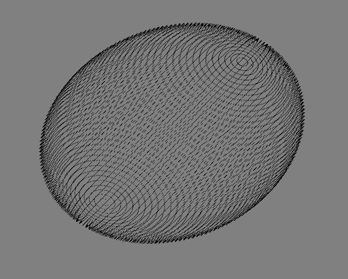

# Задача

Построить изображение эллипсоида в виде многогранника, используя ломанные.

# Основная теория

Был реализован эллипсоид с помощью формул, описывающих базовую сферу (сфера единичного радиуса):
    – в неявной форме:
        F(x,y,z) = x² + y² + z² – 1
    – в параметрической форме (u соответствует долготе (азимуту), v - широте):
        P(u,v) = (cos(v)*cos(u), cos(v)*sin(u), sin(v))

В функции, которая создает фактически сам эллипсоид def Е(), мы в цикле перебираем значения долготы (от -π до π) и широты (от -π/2 до π/2) и отображаем вершины вида P(u,v) = (cos(v)*cos(u), cos(v)*sin(u), sin(v)) (при помощи функции glVertex3fv). После прохождения всех ребер работа функции заканчивается и мы вызываем glEnd(), чтобы сообщить об этом OpenGL.

При помощи домножения координат на изменяемые клавишами (Y, X, Z) переменные DX, DY, DZ происходит изменение размеров и соотношений эллипсоида (полуосей по x, y, z).

Вызов glClear(GL_COLOR_BUFFER_BIT | GL_DEPTH_BUFFER_BIT) очищает буферы цвета и глубины OpenGL.

\newpage

# Практическая реализация

**`lab3.py`**
```py
import glfw
from OpenGL.GL import *
import random
import math
M_PI = 3.1415926535

deltaZ = 0.0
deltaX = 0.0
deltaY = 0.0
mode = GL_FILL
deltaE = 0.05

DX = 0.5
DY = 0.5
DZ = 0.5

def makeMZ(d):
    return [[math.cos(d), math.sin(d), 0, 0], 
          [-math.sin(d),math.cos(d), 0, 0],
           [0,0,1,0], [0,0,0,1]]

def makeMX(d):
    return [[1, 0,0,0],
            [0, math.cos(d), math.sin(d), 0], 
            [0, -math.sin(d),math.cos(d), 0],
            [0,0,0,1]]

def makeMY(d):
    return [[math.cos(d), 0, -math.sin(d), 0], [0, 1, 0,0], [math.sin(d), 0,math.cos(d),0], [0,0,0,1]]

def E(delta):
    global M_PI
    global DX
    global DY
    global DZ

    v = - M_PI/2 
    u = - M_PI 
    glColor3fv((0,0,0))
    glBegin(GL_LINES)
    while (v < M_PI/2):
        while(u < M_PI):
            x=DX*math.cos(v)*math.cos(u)
            y=DY*math.cos(v)*math.sin(u)
            z=DZ*math.sin(v)
            glColor3fv((0, 0, 0))
            glVertex3f(x,y,z)

            x=DX*math.cos(v)*math.cos(u)
            y=DY*math.cos(v)*math.sin(u)
            z=DZ*math.sin(v+delta)
            glColor3fv((0, 0, 0))
            glVertex3f(x,y,z)


            u+=delta
        u= - M_PI
        v+=delta
    glEnd()

def display(window):
    global verticies
    global deltaZ
    global deltaX
    global deltaY

    global deltaE
    global mode


    glPolygonMode(GL_FRONT_AND_BACK, mode)
    glClearColor(0.5, 0.5, 0.5, 0.5)


    glMatrixMode(GL_PROJECTION)
    glLoadIdentity()

    glMatrixMode(GL_MODELVIEW)
    glLoadIdentity()
    glPushMatrix()
    glMultMatrixd(makeMY(10))
    glMultMatrixd(makeMZ(deltaZ))
    glMultMatrixd(makeMX(deltaX))
    glMultMatrixd(makeMY(deltaY))

    E(deltaE)

    glPopMatrix()


    glfw.swap_buffers(window)
    glfw.poll_events()


def key_callback(window, key, scancode, action, mods):
    global deltaZ
    global deltaY
    global deltaX
    global deltaE
    global mode

    global DX
    global DY
    global DZ
    if action == glfw.PRESS:
        if key == glfw.KEY_RIGHT_SHIFT:
            deltaZ -= 0.20
        elif key == glfw.KEY_LEFT_SHIFT:
            deltaZ += 0.20

        elif key == glfw.KEY_LEFT:
            deltaY -= 0.20
        elif key == glfw.KEY_RIGHT:
            deltaY += 0.20

        elif key == glfw.KEY_DOWN:  
            deltaX -= 0.20
        elif key == glfw.KEY_UP:
            deltaX += 0.20
        elif key == glfw.KEY_0:
            if mode == GL_LINE:
                mode = GL_FILL
            else: 
                mode = GL_LINE

        elif key == glfw.KEY_1:
            deltaE += 0.05

        elif key == glfw.KEY_X:
            if DX < 1:
                DX += 0.1
            else: DX = 0.5
        elif key == glfw.KEY_Y:
            if DY < 0.8:
                DY += 0.1
            else: DY = 0.5
        elif key == glfw.KEY_Z:
            if DZ < 1:
                DZ += 0.1
            else: DZ = 0.5
        

def main():
    global surfaces

    if not glfw.init():
        return

    display_ = (1000,800)
    window = glfw.create_window(display_[0], display_[1], "Lab3", None, None)
    if not window:
        glfw.terminate()
        return

    glfw.make_context_current(window)
    glfw.set_key_callback(window, key_callback)

    # glEnable(GL_DEPTH_TEST) 

    while not glfw.window_should_close(window):
        glClear(GL_COLOR_BUFFER_BIT|GL_DEPTH_BUFFER_BIT)
        display(window)
    glfw.destroy_window(window)
    glfw.terminate()
        
main() 
```



# Заключение 

В этой лабораторной был определен эллипсоид, реализованный с помощью использования формулы эллипсоида в параметрической форме.
Был реализован трехмерный поворот относительно всех осей домножением на матрицы поворота.
Было реализовано изменение полуосей.