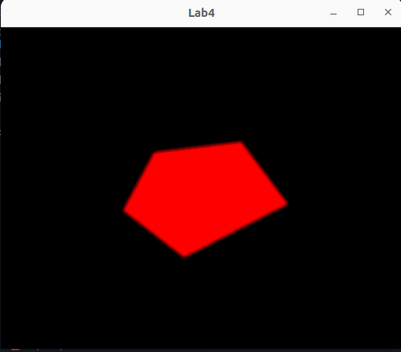

# Задача

а. Реализовать алгоритм растровой развертки многоугольника (в соответствии с вариантом):

 A1. построчного сканирования многоугольника с упорядоченным списком ребер;  
 A2. построчного сканирования многоугольника со списком активных ребер;  
 A3. заполнения многоугольника по ребрам;  
 A4. заполнения многоугольника по ребрам с перегородкой;  
 A5. заполнения многоугольника со списком ребер и флагом;  
 A6. построчного заполнения с затравкой для четырехсвязной гранично-определенной
области;  
 A7. построчного заполнения с затравкой для восьмисвязной гранично-определенной
области;  

б. Реализовать алгоритм фильтрации (в соответствии с вариантом):
 Б1. целочисленный алгоритм Брезенхема с устранением ступенчатости;  
 Б2. постфильтрация с взвешенным усреднением области NхN  
 Б3. постфильтрация с равномерным усреднением области NхN  

в. Реализовать необходимые вспомогательные алгоритмы (растеризации отрезка) с
модификациями, обеспечивающими корректную работу основного алгоритма.

г. Ввод исходных данных каждого из алгоритмов производится интерактивно с помощью
клавиатуры и/или мыши. Предусмотреть также возможность очистки области вывода (отмены
ввода).

д. Растеризацию производить в специально выделенном для этого буфере в памяти с
последующим копированием результата в буфер кадра OpenGL. Предусмотреть возможность
изменение размеров окна.

Вариант: А2 Б2, N=3

# Основная теория

• создается y-список ребер: ребра многоугольника упорядочиваются по
возрастанию по координате y начальной вершины (начальной
считается вершина с наименьшей координатой у);  
• на каждой итерации рассматривается только текущая строка
сканирования, для которой формируется список «активных» ребер
(САР), в котором хранится информация только о ребрах
многоугольника, пересекаемых текущей строкой;  

• при переходе к очередной строке сканирования:  
– из САР удаляются ребра, чья нижняя вершина оказалась выше текущей
строки сканирования;  
– из y-списка добавляются ребра, начинающиеся на данной строке
сканирования;  
– вычисляются новые точки пересечения строки сканирования с ребрами
(используя свойство пространственной когерентности, выводятся
рекуррентные соотношения):

Δx = (x₂ - x₁)/(y₂ - y₁);  
xi+1 = xi + Δx

• для каждой строки сканирования:  
– список точек пересечения с ребрами упорядочивается по возрастанию x;  
– заполняются все промежутки вида [x2i-1; x2i).

Постфильтрация выравнивает атрибуты пикселов вычисленного разрешения до вывода изображения на экране. Метод вычисления изображения с разрешением, большим, чем разрешение дисплея, и дальнейшее усреднение атрибутов нескольких пикселов для получения пикселов с меньшим разрешением можно рассматривать как постфильтрующую операцию.

# Практическая реализация

**`lab4.py`**
```py
import glfw
from OpenGL.GL import *
import random
import math

display_ = (500, 400)
colorLine = (255, 255, 0)
colorBackground = (255, 255, 0)
color = (0, 0, 0)
arrayPixels = [0]*display_[0] * display_[1] * 3

cx = 0
cy = 0
verticies = []

edges = []

countVerticies = 0

edgesActive = []


def check(x, y):
    index = x * 3 * display_[0] + y * 3
    if index >= len(arrayPixels):
        return True
    if arrayPixels[index] != 0 or arrayPixels[index + 1] != 0 or arrayPixels[index + 2] != 0:
        return True
    else:
        return False


def cursor_pos(window, ypos, xpos):
    global cx, cy
    cx = round(display_[0] - xpos - 100)
    cy = round(ypos)


def filllineup(x, y):
    global countVerticies
    if check(x, y):
        return
    verticies.append((x, y))
    countVerticies += 1
    if countVerticies > 1:
        if countVerticies == 3:
            edges.append((0, 1))
        edges.append((countVerticies-2, countVerticies-1))
        if countVerticies > 2:
            deleteLine()
            edges[0] = (0, countVerticies-1)


def mouse_button(window, button, action, mods):
    global cx, cy
    if action == glfw.PRESS:
        if button == glfw.MOUSE_BUTTON_LEFT:
            filllineup(cx, cy)
            if len(edges) > 0:
                drawLines()

# --------------------------------------------------


def drawLine(point1, point2, color):
    x1 = point1[0]
    y1 = point1[1]
    x2 = point2[0]
    y2 = point2[1]

    x, y = x1, y1
    dx = x2 - x1
    dy = y2 - y1

    sign_x = 1 if dx > 0 else -1 if dx < 0 else 0
    sign_y = 1 if dy > 0 else -1 if dy < 0 else 0

    if dx < 0:
        dx = -dx
    if dy < 0:
        dy = -dy

    if dx > dy:
        pdx, pdy = sign_x, 0
        es, el = dy, dx
    else:
        pdx, pdy = 0, sign_y
        es, el = dx, dy

    error, t = el/2, 0
    arrayPixels[3*x*display_[0] + 3*y] = color[0]
    arrayPixels[3*x*display_[0] + 3*y + 1] = color[1]
    arrayPixels[3*x*display_[0] + 3*y + 1] = color[2]

    while t < el:
        error -= es
        if error < 0:
            error += el
            x += sign_x
            y += sign_y
        else:
            x += pdx
            y += pdy
        t += 1
        arrayPixels[3*x*display_[0] + 3*y] = color[0]
        arrayPixels[3*x*display_[0] + 3*y + 1] = color[1]
        arrayPixels[3*x*display_[0] + 3*y + 1] = color[2]
        arrayPixels[3*(x + 1)*display_[0] + 3*y] = color[0]
        arrayPixels[3*(x + 1)*display_[0] + 3*y + 1] = color[1]
        arrayPixels[3*(x + 1)*display_[0] + 3*y + 1] = color[2]


def drawLines():
    for edge in edges:
        drawLine(verticies[edge[0]], verticies[edge[1]], colorLine)


def deleteLine():
    drawLine(verticies[edges[0][0]], verticies[edges[0][1]], (0, 0, 0))

# ------------------------------------


def fill(startY, endY):
    for y in range(startY, endY):
        edgesActive = []
        for edge in edges:  # y = dx*(x-x1) + y1  x = (y - y1)*dx +x1
            x1 = verticies[edge[0]][0]
            x2 = verticies[edge[1]][0]
            y1 = verticies[edge[0]][1]
            y2 = verticies[edge[1]][1]
            if (y1 >= y and y2 <= y) or (y1 <= y and y2 >= y):
                dx = (x2 - x1)/(y2 - y1)
                # dx = dx if dx > 0 else -dx
                x = int(math.ceil(((y - y1)*dx) + x1))
                edgesActive.append(x)
        edgesActive.sort()
        i = 0
        x0 = 0
        for xi in edgesActive:
            if i % 2 == 0:
                x0 = xi
            else:
                if x0 == xi:
                    i += 1
                else:
                    for X in range(x0, xi):
                        arrayPixels[3*X*display_[0] + 3*y] = color[0]
                        arrayPixels[3*X*display_[0] + 3*y + 1] = color[1]
                        arrayPixels[3*X*display_[0] + 3*y + 1] = color[2]
            i += 1

# -------------------------


def display(window):

    glLoadIdentity()
    glClearColor(1, 1, 1, 1)
    glRasterPos2d(-1, -1)
    glDrawPixels(display_[0], display_[1], GL_RGB,
                 GL_UNSIGNED_BYTE, arrayPixels)

    glfw.swap_buffers(window)
    glfw.poll_events()


def frange(x, y, jump):
    while x < y:
        yield x
        x += jump


def randomColor():
    levels = list(frange(50, 255, 1))
    return tuple(random.choice(levels) for _ in range(3))


def key_callback(window, key, scancode, action, mods):
    global color, arrayPixels, verticies, edges, countVerticies, colorLine, colorBackground
    if action == glfw.PRESS:
        if key == glfw.KEY_RIGHT_SHIFT:
            color = (0, 0, 0) if color == colorBackground else colorBackground
            minV = display_[1] + 1
            maxV = -1
            for v in verticies:
                if v[1] < minV:
                    minV = v[1]
                if v[1] > maxV:
                    maxV = v[1]
            fill(minV + 1, maxV - 1)
        elif key == glfw.KEY_ENTER:
            Postfiltration()
        elif key == glfw.KEY_0:
            arrayPixels = [0]*display_[0] * display_[1] * 3
            verticies = []
            edges = []
            countVerticies = 0
            colorBackground = randomColor()
            color = (0, 0, 0)
            colorLine = randomColor()


# -------------------


def getNeighborsSum(i, j, N):
    res1 = 0
    res2 = 0
    res3 = 0
    c = 0
    k = i - N - 1
    while (k - (i - 1) < N):
        l = j - N - 1
        while (l - (j - 1) < N):
            if (k >= 0 and k < display_[1] and l >= 0 and l < display_[0]):
                res1 += arrayPixels[display_[0]*k * 3+l*3]
                res2 += arrayPixels[display_[0]*k * 3+l*3 + 1]
                res3 += arrayPixels[display_[0]*k * 3+l*3 + 2]
                c += 1
            l += 1
        k += 1
    return (res1//c, res2//c, res3//c)


def Postfiltration():
    global arrayPixels
    tempPixels = [0]*display_[0]*display_[1]*3
    for i in range(0, display_[1]):
        for j in range(0, display_[0]):
            color = getNeighborsSum(i, j, 3)
            tempPixels[i*display_[0]*3 + j*3] = color[0]
            tempPixels[i*display_[0]*3 + j*3 + 1] = color[1]
            tempPixels[i*display_[0]*3 + j*3 + 2] = color[2]

    arrayPixels = tempPixels
    print("Postfiltration is successful")


def main():

    if not glfw.init():
        return

    window = glfw.create_window(display_[0], display_[1], "Lab4", None, None)
    if not window:
        glfw.terminate()
        return

    glfw.make_context_current(window)
    glfw.set_key_callback(window, key_callback)
    glfw.set_cursor_pos_callback(window, cursor_pos)
    glfw.set_mouse_button_callback(window, mouse_button)

    # glEnable(GL_DEPTH_TEST)

    while not glfw.window_should_close(window):
        glClear(GL_COLOR_BUFFER_BIT | GL_DEPTH_BUFFER_BIT)
        display(window)
    glfw.destroy_window(window)
    glfw.terminate()


main()

```
# Заключение 

В этой лабораторной был реализован алгоритм растровой развертки многоугольника (построчного сканирования многоугольника со списком активных ребер), ввод точек которого производится интерактивно с помощью мыши.
Был реализован алгоритм постфильтрации с взвешенным усреднением области NхN.


